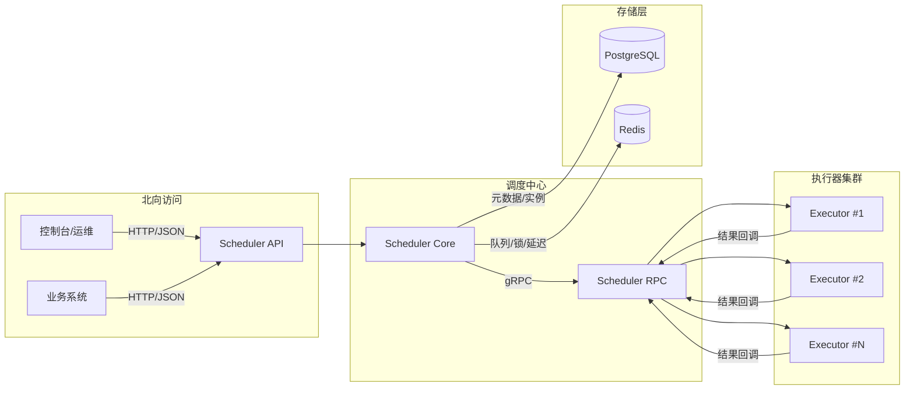

# StarFlow Scheduler 架构与核心流程

## 项目介绍
StarFlow Scheduler 是一个基于 Go 的分布式任务调度系统，采用“调度中心 + 执行器集群”的架构形态，提供北向 HTTP/JSON 接口与南向 gRPC 内部通信，支持定时/延时/一次性/DAG 任务、任务分片、幂等与重试、死信处理等核心能力。

技术选型要点：
- 框架：go-zero（API + RPC）
- ORM：ent
- 数据库：PostgreSQL（元数据与执行记录）
- 内部通信：gRPC

## 架构图

## 核心流程说明

### 1. 任务定义创建
1. 业务系统调用 `POST /api/v1/jobs` 创建任务定义。
2. API 进行参数校验（类型、cron/延时规则、handler 约束）。
3. Repository 通过 ent 写入 PostgreSQL。

### 2. 任务触发与调度
1. 调度中心扫描触发条件（cron/延时/手动触发）。
2. 生成任务实例（job_instances），更新状态为 `pending`。
3. 根据路由与负载策略选择执行器。

### 3. 任务派发与执行
1. 调度中心通过 gRPC 调用执行器 `DispatchJob`。
2. 执行器接收并执行 handler。
3. 执行器执行完成后上报 `ReportResult`。

### 4. 重试与死信
1. 失败任务根据 retry policy 进入重试队列。
2. 多次失败后转入 dead_letters，支持手动/批量重试。

### 5. DAG 工作流
1. Workflow 定义节点依赖与触发条件。
2. 调度中心按拓扑推进，满足条件后触发下游节点。

## 组件职责
- Scheduler API：北向 REST 接入，任务管理与查询。
- Scheduler RPC：南向 gRPC 接口，执行器注册、心跳、派发与回调。
- Executor：执行任务 handler，保证幂等与上报。
- PG：任务定义、实例、日志、死信等元数据存储。
- Redis：延迟队列、分布式锁、待派发队列。

